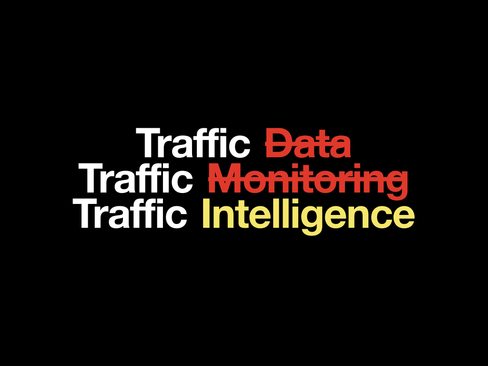

# Positioning

`status: canonical` · **This is the pitch. It leads every document, deck and conversation.**

<p align="center">
  
</p>

> **What the strikethroughs mean.** Not that data and monitoring are worthless — Siliguri
> **can manage both**. They mean **the focus has moved past them.** Those tiers exist or
> are obtainable today. **The missing tier is intelligence**, and that is where attention
> now belongs.

---

# The thesis

> **Traffic Data tells us what happened.**
>
> **Traffic Monitoring tells us what is happening.**
>
> **Traffic Intelligence tells us what it means.**

## And for Siliguri

> **SARGVISION is exploring how to build Siliguri's digital memory of urban mobility — so
> that traffic decisions can increasingly be informed by patterns and evidence, not only by
> what is visible at a particular moment.**

---

# The three tiers

## 1 · Traffic Data

Raw information exists, or can progressively become available:

- historical travel observations;
- Google Maps mobility capabilities;
- future authorised city datasets;
- future traffic operational data.

**By itself, data does not create understanding.**

## 2 · Traffic Monitoring

Tools such as Google Maps answer *"what is happening right now?"* —

- traffic is slow here;
- this route takes longer;
- take an alternative route.

**This is situational awareness.** It is genuinely valuable, and it is not what is missing.

## 3 · Traffic Intelligence — the layer we are exploring

Traffic Intelligence asks: **what patterns are emerging from what we observe over time?**

```text
TODAY'S MOBILITY
       +
HISTORICAL PATTERNS
       +
EXPECTED BEHAVIOUR
       ↓
UNDERSTANDING
       ↓
UNUSUAL / RECURRING / IMPORTANT PATTERNS
```

**This is the core differentiation.**

---

# Does Siliguri actually need this?

**The honest answer: potentially yes — and the value is in the accumulation of knowledge
over time.**

A traffic officer can see today's traffic. Google Maps can show today's congestion. **But
neither inherently creates a Siliguri-specific memory of mobility behaviour that can be
investigated over time.**

That is the key idea.

## The example that makes it concrete

**Google Maps can tell you:**

> *"Traffic is slow between Point A and Point B right now."*

**Traffic Intelligence aims to answer:**

> *Is this normal for Siliguri at this time?*
> *Has this happened repeatedly?*
> *How does this movement behave across days?*
> *Is the situation becoming better or worse?*
> *Which movements are consistently unreliable?*

**That is where the layer has potential value.**

---

# The real product thesis

**The product is not competing with Google Maps.** Google Maps is an important **data and
monitoring layer**. SARGVISION sits conceptually **above** it.

```text
┌─────────────────────────────────────┐
│      SARGVISION TRAFFIC             │
│       INTELLIGENCE                  │
│                                     │
│ • Pattern Analysis                  │
│ • Historical Baselines              │
│ • Anomaly Detection                 │
│ • Reliability Analysis              │
│ • City-specific Mobility Memory     │
│ • AI Investigation Copilot          │
└─────────────────────────────────────┘
                  ▲
                  │
┌─────────────────────────────────────┐
│       TRAFFIC MONITORING            │
│                                     │
│ Google Maps / Authorised Sources    │
│                                     │
│ Current Conditions                  │
│ Travel Times                        │
│ Route Information                   │
└─────────────────────────────────────┘
                  ▲
                  │
┌─────────────────────────────────────┐
│          TRAFFIC DATA               │
│                                     │
│ Historical + Live + Future Sources  │
└─────────────────────────────────────┘
```

---

# The actual value proposition

The question is **not** *"do they need another dashboard?"* — **no.**

The question is:

> **Can Siliguri benefit from building institutional intelligence about its own mobility
> patterns, instead of repeatedly relying only on real-time observation and individual
> experience?**

**That is the actual thesis.**

A city grows institutional knowledge when it can answer:

```text
WHAT HAPPENED BEFORE?
        ↓
WHAT IS NORMAL?
        ↓
WHAT IS DIFFERENT NOW?
        ↓
WHAT SHOULD WE INVESTIGATE?
```

**That is what Traffic Intelligence means in this project.**

---

# Why "memory" is the right word

Today, Siliguri's mobility knowledge lives in **individual experience** — the officer who
knows that a junction goes bad around a certain hour, the constable who has worked a
corridor for years. **That knowledge is real, and it leaves when they do.**

An institutional memory is different: it accumulates, it can be interrogated by someone
who was not there, and it compounds rather than resetting each morning.

> **A monitoring tool has no memory by design.** It is answering *"now"*, correctly, every
> time you ask — and it forgets. That is not a flaw in the tool. It is the boundary of what
> that tier does, and the reason the tier above it has to exist separately.

## The honest consequence

**Memory compounds, which means it starts thin.** The demonstrator runs on 101,418
historical observations — enough to show the *shape* of what a mobility memory looks like
and to calibrate against real Siliguri behaviour, **not enough to be one yet.**

**The value proposition and the limitation are the same sentence:** this gets more valuable
every month it runs. That should be said plainly rather than dressed up, because it is also
the argument for starting now instead of later.

---

# The ladder is what we built

| Tier | In this product | Evidence |
|---|---|---|
| **Data** | 101,418 valid primary-route observations, openly licensed | [provenance](data-provenance.md) |
| **Monitoring** | Available to the city already; **not something we rebuilt** | — |
| **Intelligence** | Baselines · anomaly detection · confidence · operational priority · evidence coverage | [spike](methodology/spatial-feasibility-spike.md) · [limitations](known-limitations.md) |
| **Decisions** | Prioritised attention, with what we do not know stated alongside | [design](design/ui-ux.md) |

**We built no monitoring tier, deliberately.** Siliguri can obtain monitoring. Building a
fourth dashboard would have consumed the effort the missing tier needed.

---

# What keeps the claim honest

An intelligence layer is only worth anything if it is trustworthy, so the product states
its limits as prominently as its findings:

- every figure carries **confidence** and **sample size**;
- every figure records **which baseline level produced it**;
- the map shows **where we have no evidence**, rather than rendering absence as calm;
- **42.4%** of observations are scored — published plainly, never implied as city-wide;
- the demonstrator says **historical replay**, never *live*.

**An intelligence layer that overclaims is just a dashboard with better adjectives.**
